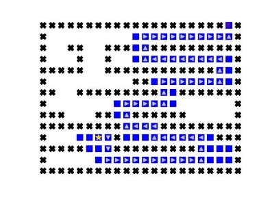
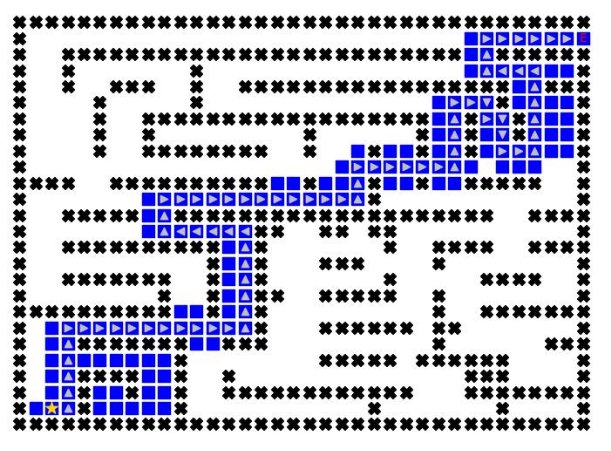
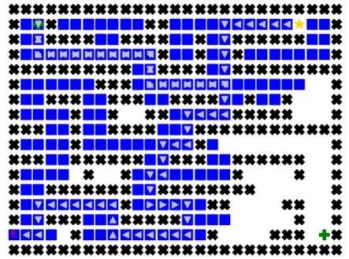
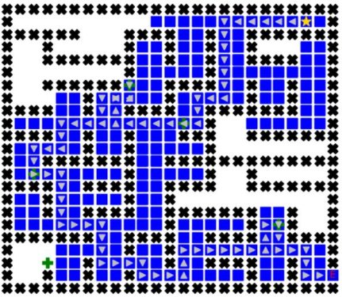

**TRƯỜNG ĐẠI HỌC KHOA HỌC TỰ NHIÊN KHOA CÔNG NGHỆ THÔNG TIN** 

**BÁO CÁO ĐỒ ÁN** 

THUẬT TOÁN TÌM KIẾM 

Thực hiện:   19120620 – Mai Hồng Phúc 

19120628 – Hoàng Anh Quân 

**Mục lục** 

1. [MỘT SỐ THUẬT TOÁN TÌM KIẾM ............................................................................ 3 ](#_page2_x54.00_y43.00)
1. [Depth First Search (DFS).............................................................................................. 3 ](#_page2_x54.00_y64.00)
1. [Breadth First Search (BFS) ........................................................................................... 3 ](#_page2_x54.00_y559.00)
1. [Greedy Best First Search (tìm kiếm tham lam) ............................................................ 4 ](#_page3_x54.00_y387.00)
1. [A* Search (tìm kiếm A*) .............................................................................................. 4 ](#_page3_x54.00_y619.00)
1. [Hai hàm heuristic được sử dụng trong đồ án ................................................................ 5 ](#_page4_x54.00_y109.00)
2. [BẢN ĐỒ KHÔNG CÓ ĐIỂM THƯỞNG ....................................................................... 6 ](#_page5_x54.00_y43.00)
1. [Bản đồ 1 ........................................................................................................................ 6 ](#_page5_x90.00_y93.00)
1. [Bản đồ 2 ...................................................................................................................... 10 ](#_page9_x90.00_y43.00)
1. [Bản đồ 3 ...................................................................................................................... 14 ](#_page13_x54.00_y43.00)
1. [Bản đồ 4 ...................................................................................................................... 18 ](#_page17_x90.00_y43.00)
1. [Bản đồ 5 ...................................................................................................................... 22 ](#_page21_x54.00_y43.00)
3. [BẢN ĐỒ CÓ ĐIỂM THƯỞNG ................................................................................. 30 ](#_page29_x54.00_y43.00)
1. [Bản đồ 6 (2 điểm thưởng) ........................................................................................... 31 ](#_page30_x90.00_y43.00)
1. [Bản đồ 7 (5 điểm thưởng) ........................................................................................... 33 ](#_page32_x54.00_y43.00)
1. [Bản đồ 8 (10 điểm thưởng) ......................................................................................... 35 ](#_page34_x54.00_y43.00)
4. [BẢN ĐỒ CÓ CÁCH CỔNG DỊCH CHUYỂN ............................................................. 37 ](#_page36_x54.00_y43.00)
1. [Bản đồ 9 ...................................................................................................................... 38 ](#_page37_x54.00_y43.00)
1. [Bản đồ 10 .................................................................................................................... 39 ](#_page38_x90.00_y43.00)
1. [Bản đồ 11 .................................................................................................................... 40 ](#_page39_x54.00_y43.00)
1. [Nhận xét chung ........................................................................................................... 41 ](#_page40_x54.00_y43.00)
1. **MỘT SỐ THUẬT TOÁN TÌM KIẾM** 
1. **Depth First Search (DFS)** 

- *Mô tả:* DFS là một chiến lược tìm kiếm luôn chọn nút ở biên sâu nhất từ nút gốc rồi từ từ mở rộng ra trên cây tìm kiếm. 
- *Lưu vùng biên:* Quy tắc của DFS là sẽ thay thế nút sâu nhất trong biên bằng các nút con của nó. Ngăn xếp (stack - LIFO) là cấu trúc thích hợp nhất để lưu trữ vùng biên này. 
- *Tính đầy đủ:* DFS không phải là thuật toán tìm kiếm đầy đủ. Nếu tồn tại một chu trình trong đồ thị không gian trạng thái thì độ sâu của cây tìm kiếm là vô hạn. Do đó, DFS có thể sẽ bị mắc kẹt trong khi tìm kiếm nút sâu nhất trong cây tìm kiếm sâu vô hạn và không bao giờ tìm được lời giải. 
- *Tính tối ưu*: DFS đơn giản chỉ là tìm kiếm giải pháp “trái nhất” trong cây tìm kiếm mà không quan tâm đến chi phí, nên DFS không tối ưu. 
- *Độ phức tạp thời gian:* Trong trường hợp xấu nhất, DFS cần phải duyệt toàn bộ cây. Vì vậy, với cây tìm kiếm có độ sâu là m, thì độ phức tạp là O(bm). 
- *Độ phức tạp không gian:* Trong trường hợp xấu nhất, DFS sẽ giữ b nút tại mỗi tầng tới tầng có độ sâu m. Do đó, độ phức tạp không gian của DFS là O(bm). 
2. **Breadth First Search (BFS)** 
- *Mô tả:* BFS là chiến lược tìm kiếm luôn chọn phần nông nhất từ một nút để mở rộng ra xung quanh. 
- *Lưu vùng biên:* Nếu chúng ta muốn truy cập các nút nông hơn rồi mới tới các nút sâu hơn, chúng ta phải truy cập các nút theo thứ tự chèn của chúng. Đối với điều này, hàng đợi (queue - FIFO) là cấu trúc thích hợp nhất cho BFS. 
- *Tính đầy đủ:* Nếu tồn tại một lời giải, thì độ sâu của nút nông nhất phải là hữu hạn, vì vậy BFS phải tìm đến đến độ sâu này. Do đó, BFS có tính đầy đủ. 

- *Tính tối ưu:* BFS thường không phải là giải pháp tìm kiếm tối tối ưu, vì nó không tính đến chi phí khi xác định nút nào cần thay thế trên phần rìa. Trường hợp BFS được tối ưu là nếu tất cả các chi phí đến các node là như nhau. 
- *Độ phức tạp thời gian:* Chúng ta phải tìm kiếm 1 + b + b2 + ... + bm trong trường hợp xấu nhất, vì nó đã duyệt qua tất cả các nút ở mọi độ sâu từ 1 đến m. Do đó, độ phức tạp về thời gian là O(bm) 
- *Độ phức tạp không gian:* Trong trường hợp xấu nhất, phần biên chứa tất cả các nút ở mức tương ứng vì lời giải nông nhất nằm ở độ sâu m nên có O(bm) các nút tại độ sâu này. 
3. **Greedy Best First Search (tìm kiếm tham lam)** 
- *Mô tả:* Tìm kiếm tham lam là một chiến lược tìm kiếm mà nó luôn chọn nút ở biên có giá trị heuristic thấp nhất (tương ứng với với nút mà nó tin là gần kết quả nhất) để mở rộng. 
- *Lưu vùng biên:* Tìm kiếm tham lam sử dụng hàng đợi ưu tiên để lưu các nút ở vùng biên, sau đó sẽ sắp xếp và chọn nút có giá trị heuristic (giá trị ước tính từ nút hiện tại đến nút kết quả) nhỏ nhất để mở rộng. 
- *Tính đầy đủ và tính tối ưu:* Tìm kiếm tham lam không đảm bảo sẽ tìm được lời giải nếu bài toán có lời giải nên chiến lược này không tối ưu, đặc biệt trong trường hợp hàm heuristic được chọn không đủ tốt. Chiến lược tìm kiếm này thường hoạt động khá khó đoán, đôi khi nó hoạt giống như DFS định hướng sai và phải duyệt nhiều nút không dẫn đến kết quả.  
4. **A\* Search (tìm kiếm A\*)** 
- *Mô tả:* Tìm kiếm A\* là một chiến lược luôn chọn những nút ở biên có tổng giá trị hàm heuristic và chi phí đã đi được là nhỏ nhất để mở rộng. 
- *Lưu vùng biên:* Cũng giống như tìm kiếm tham lam, A\* sử dụng hàng đợi ưu tiên để lưu trữ các nút vùng biên. Tuy nhiên, A\* lại sử dụng cả giá trị heuristic (giá trị ước tính từ nút hiện tại đến nút kết quả) và chi phí đã đi được để sắp xếp thứ tự ưu tiên. 
- *Tính đầy đủ và tính tối ưu:* Tìm kiếm A\* có cả tính đầy đủ và tối ưu. Bởi vì A\* là sự kết hợp của nhiều ưu điểm từ các chiến lược tìm kiếm khác (có cả tốc độ tìm kiếm nhanh của tìm kiếm tham lam). 
5. **Hai hàm heuristic được sử dụng trong đồ án** 
- Hàm ước tính khoảng cách từ pos (vị trí hiện tại) đến end (điểm đích) dựa vào khoảng cách Euclidean (heuristic Euclidean):

ℎ = √( [ ]2 − [ ]2) − ( [ ]2 − [ ]2) 

- Hàm ước tính khoảng cách từ pos (vị trí hiện tại) đến end (điểm đích) dựa vào khoảng cách Manhattan (heuristic Manhattan):

ℎ = | [ ] − [ ]| + | [ ] − [ ]| 

2. **BẢN ĐỒ KHÔNG CÓ ĐIỂM THƯỞNG** 

***Lưu ý**: Các ô được đánh dấu màu xanh là các ô đã được xét trong các chiến lược.* 

1. **Bản đồ 1** 

**DFS** 

- *Độ dài đường đi:* 27  

Đường đi không tối ưu, do đặc  trưng của DFS là tìm kiếm theo  nhánh nên đây là giải pháp “trái  nhất” trong cây tìm kiếm.  

- *Số ô đã đi qua:* 37  

Vì đường đi là nhánh nằm ở phía  trái ở cây tìm kiếm nên số lượng  ô đã đi qua không quá lớn so với  độ dài đường đi.  

**BFS** 

- *Độ dài đường đi:* 19  

Đây là đường đi tối ưu, do BFS  tìm kiếm theo chiều rộng nên kết  quả trả về sẽ là nhánh ngắn nhất  (đường đi ngắn nhất).  

- *Số ô đã đi qua:* 79  

Cũng vì tìm kiếm theo chiều rộng  mà BFS phải duyệt hết các nút ở  từng tầng nên số ô đã đi qua sẽ có  số lượng rất lớn.  

**Tìm kiếm tham lam (Euclidean)** 

- *Độ dài đường đi:* 19  

Với heuristic tính khoảng cách  Euclidean giữa điểm hiện tại và  đích đến, thuật toán đã tìm được  đường đi tối ưu.  

- *Số ô đã đi qua:* 35  

Số ô đã đi qua không quá lớn,  cho thấy tìm kiếm tham lam với  heuristic này là tốt nhất để tìm  lời giải cho bản đồ 1.  

**Tìm kiếm tham lam (Manhattan)** 

- *Độ dài đường đi:* 21  

Đây không phải là đường đi tối  ưu. Nhưng nó đủ ngắn để chấp  nhận là lời giải tốt cho bản đồ 1  (chi phí di chuyển chỉ lớn hơn 2 ô  so với đường đi tối ưu).  

- *Số ô đã đi qua:* 41  

Số lượng ô đã đi qua lớn gần gấp  đôi so với chiều dài đường đi cho  thấy  heuristic  Manhattan  không  tốt bằng heuristic Euclidean trong  giải thuật cho bản đồ 1. 

**Tìm kiếm A\* (Euclidean)  **

- *Độ dài đường đi:* 19  

Đây là đường đi tối ưu cho bản  đồ 1.  

- *Số ô đã đi qua:* 46  

Số ô đã đi qua lớn hơn so với tìm  

kiếm  tham  lam  có  cùng  loại  

heuristic. Điều này cho thấy tìm  

kiếm  tham  lam  hiệu  quả  hơn  

trong việc tìm lời giải cho bản đồ  1.  

**Tìm kiếm A\* (Manhattan)  **

- *Độ dài đường đi:* 19  

Đây là đường đi tối ưu của bản đồ  1.  

- *Số ô đã đi qua:* 41   

Có cùng số ô đã đi qua với tìm  kiếm  tham  lam  có  cùng  loại  heuristic,  nhưng  A\*  đã  tìm  ra  được đường đi tối ưu. Do đó A\*  hiệu quả hơn tìm kiếm tham lam  với heuristic Manhattan.  

***Đánh giá chung*** 

**MAZE I**

90

80 

70 

60 

50 60

40

**BƯỚC**

30 10 16 20 27 22

20

10 27 19 19 21 19 19

0

DFS BFS Greedy Greedy A\* (Euclidean) A\* (Euclidean) (Manhattan) (Manhattan)

Độ dài đường đi Độ chênh lệch

- Dựa vào biểu đồ trên, ta thấy tìm kiếm tham lam với heuristic Euclidean là chiến lược tốt nhất để tìm lời giải cho bản đồ 1. 
- Với các hàm heuristic, các giải thuật tìm kiếm có thông tin thể hiện sự vượt trội hơn trong việc tìm kiếm lời giải cho bản đồ so với các giải thuật tìm kiếm mù, do bởi trí thức đã được đưa vào thông qua các hàm heuristic. 
2. **Bản đồ 2** 

**DFS** 

- *Độ dài đường đi:* 64  

Đường đi không tối ưu, do đặc  trưng của DFS là tìm kiếm theo  nhánh nên đây là giải pháp “trái  nhất” trong cây tìm kiếm.  

- *Số ô đã đi qua:* 80  

Vì đường đi là nhánh nằm ở phía  trái ở cây tìm kiếm nên số lượng  ô đã đi qua không quá lớn so với  độ dài đường đi.  

**BFS** 

- *Độ dài đường đi:* 56  

Đây là đường đi tối ưu, do BFS  tìm kiếm theo chiều rộng nên kết  quả trả về sẽ là nhánh ngắn nhất  (đường đi ngắn nhất).  

- *Số ô đã đi qua:* 149  

BFS  đã  duyệt  hết  tất  cả  các  ô  trống trong bản đồ 2. Do đường  đi  ngắn  nhất  cũng  là  nhánh  có  chiều dài dài nhất trong cây tìm  kiếm (có nghĩa là BFS đã duyệt  hết cây tìm kiếm).  

**Tìm kiếm tham lam (Euclidean)** 

- *Độ dài đường đi:* 60  

Đây không phải là đường đi tối  ưu  nhưng  nó  đủ  ngắn  để  chấp  nhận là một lời giải tốt cho bản đồ  2 (chi phí di chuyển chỉ hơn 4 ô  so với đường đi tối ưu).  

- *Số ô đã đi qua:* 96  

Số ô đã đi qua lớn hơn so với DFS  và nhỏ hơn so với BFS, cho thấy  đây là thuật giải có hiệu quả trung  bình giữa DFS và BFS.  

**Tìm kiếm tham lam (Manhattan)** 

- *Độ dài đường đi:* 60  

Đây không phải là đường đi tối  ưu. Nhưng nó đủ ngắn để chấp  nhận là lời giải tốt cho bản đồ 2  

(chi phí di chuyển chỉ lớn hơn 4  ô so với đường đi tối ưu).  

- *Số ô đã đi qua:* 87  

Số lượng ô đã đi qua nhỏ hơn so  với  tìm  kiếm  tham  lam  với  heuristic Euclidean nhưng lại tìm  ra đường đi có độ dài bằng nhau.  Heuristic  Manhattan  hiệu  quả  hơn so với Euclidean trong tìm  kiếm tham lam. 

**Tìm kiếm A\* (Euclidean)** 

- *Độ dài đường đi:* 56  

Đây là đường đi tối ưu cho bản  đồ 2.  

- *Số ô đã đi qua:* 137  

Số ô đã đi qua ít hơn so với BFS,  cho thấy A\* hiệu quả hơn trong  việc tìm lời giải cho bản đồ 2.  

**Tìm kiếm A\* (Manhattan)** 

- *Độ dài đường đi:* 56  Đây là đường đi tối ưu của bản đồ  
 
- *Số ô đã đi qua:* 134  

Có số ô đã đi qua ít hơn so với A\*  với heuristic Euclidean, heuristic  Manhattan có hiệu quả hơn trong  việc tìm lời giải của bản đồ 2.  

***Đánh giá chung*** 

**MAZE II**

160 

140 

120 

100 93 81 78

80 16 36 27

**BƯỚC** 60

40

64 56 60 60 56 56

20

0

DFS BFS Greedy Greedy A\* (Euclidean) A\*

(Euclidean) (Manhattan) (Manhattan)

Độ dài đường đi Độ chênh lệch

- BFS và A\* đã tìm ra được đường đi tối ưu cho bản đồ 2. Tuy nhiên cả 3 chiến lược đều cần phải duyệt qua gần như hầu hết vị trí trên bản đồ nên mức độ hiệu quả của 3 chiến lược này là tương đương nhau. 
- DFS tuy không tìm ra được đường đi tối ưu nhưng lại có số ô đi qua ít nhất (do DFS chỉ tìm ra được nhánh dẫn đến kết quả là dừng, không duyệt hết bản đồ). 
- A\* tìm ra được đường đi ngắn nhất trong khi tìm kiếm tham lam chỉ tìm được đường đi đủ ngắn. A\* cho thấy sự vượt trội hơn nhờ sử dụng cả 2 hàm đánh giá (heuristic và độ dài đi được). Trong khi đó tìm kiếm tham lam chỉ sử dụng hàm heuristic. 
3. **Bản đồ 3** 

**DFS** 

- *Độ dài đường đi:* 65  

Đường đi không tối ưu, do đặc  trưng của DFS là tìm kiếm theo  nhánh nên đây là giải pháp “trái  nhất” trong cây tìm kiếm.  

- *Số ô đã đi qua:* 190  

Tại bản đồ 3, DFS đã cho thấy  được  điểm  yếu  của  thuật  toán.  Tuy  là  tìm  nhánh  “trái  nhất”  nhưng nhánh này lại nằm ở phía  “phải”, nên DFS phải duyệt gần  hết bản đồ. Do đó số lượng ô đã đi  qua là rất lớn.  

**BFS  **

- *Độ dài đường đi:* 47  

Đây là đường đi tối ưu, do BFS  tìm kiếm theo chiều rộng nên kết  quả trả về sẽ là nhánh ngắn nhất  (đường đi ngắn nhất).  

- *Số ô đã đi qua:* 231  

BFS cần phải duyệt hết các nút ở  từng tầng nên số ô đã đi qua sẽ  có số lượng rất lớn. Vì đường đi  tối ưu là nhánh dài nhất nên BFS  đã phải duyệt hết bản đồ 3.  

**Tìm kiếm tham lam (Euclidean)** 

- *Độ dài đường đi:* 49  

Đây là lời giải có thể chấp nhận  được (hơn đường đi tối ưu chỉ 2  ô).  

- *Số ô đã đi qua:* 118  

Số ô đã đi qua chỉ bằng khoảng  một nửa so với BFS nhưng lại cho  đường đi chỉ lớn hơn 2 ô. Việc sử  dụng heuristic đã cho kết quả đủ  tốt mà không cần phải duyệt hết  bản đồ.  

**Tìm kiếm tham lam (Manhattan)** 

- *Độ dài đường đi:* 51  

Đây là lời giải có thể chấp nhận  được (hơn đường đi tối ưu chỉ 4  ô).  

- *Số ô đã đi qua:* 128  

Số lượng ô đã đi qua và độ dài  đường đi đều lớn hơn so với tìm  kiếm  tham  lam  với  heuristic  Euclidean.  Do  đó,  heuristic  Euclidean  hiệu  quả  hơn  Manhattan.  

**Tìm kiếm A\* (Euclidean)** 

- *Độ dài đường đi:* 47  

Đây là đường đi tối ưu cho bản  đồ 3.  

- *Số ô đã đi qua:* 189  

A\*  với  heuristic  Euclidean  đã  tìm  ra  đường  đi  tối  ưu  nhưng  duyệt  ít  ô  hơn  BFS.  Với  hàm  heuristic,  A\*  có  tính  hiệu  quả  hơn BFS.  

**Tìm kiếm A\* (Manhattan)** 

- *Độ dài đường đi:* 47  

Đây là đường đi tối ưu của bản  đồ 3.  

- *Số ô đã đi qua:* 180  

Có số ô đã đi qua ít hơn so với  A\*  với  heuristic  Euclidean,  heuristic Manhattan có hiệu quả  hơn trong việc tìm lời giải của  bản đồ 3.  

***Đánh giá chung***  

**MAZE III**

250

200 

150 

184

125 142 133

**BƯỚ**1**C** 00

69 77

50 

65 47 49 51 47 47

0

DFS BFS Greedy Greedy A\* (Euclidean) A\* (Euclidean) (Manhattan) (Manhattan)

Độ dài đường đi Độ chênh lệch

- DFS không còn hiệu quả trên bản đồ 3 như 2 bản đồ trước. Đây là trường hợp bất lợi cho DFS khi phải duyệt gần hết cây tìm kiếm. 
- BFS tuy tìm ra được đường đi ngắn nhất nhưng lại phải duyệt hết toàn bộ các ô trên bản đồ. Đối với tìm kiếm mù thì duyệt toàn bộ là cách duy nhất để tìm đường đi tối ưu. 
- A\* lại cho thấy sự vượt trội hơn nhờ sử dụng cả 2 hàm đánh giá (heuristic và độ dài đi được). Trong khi đó tìm kiếm tham lam chỉ sử dụng hàm heuristic. 
4. **Bản đồ 4** 

**DFS  **

- *Độ dài đường đi:* 100  

Đường đi không tối ưu, do đặc trưng  của DFS là tìm kiếm theo nhánh nên  đây là giải pháp “trái nhất” trong cây  tìm kiếm.  

- *Số ô đã đi qua:* 283  

Tương tự bản đồ 3, ở bản đồ 4, DFS  cũng phải duyệt gần hết các ô do lời  giải nằm ở nhánh phía bên “phải”.  

**BFS  **

- *Độ dài đường đi:* 54  

Đây là đường đi tối ưu, do BFS tìm  kiếm theo chiều rộng nên kết quả trả về  sẽ là nhánh ngắn nhất (đường đi ngắn  nhất).  

- *Số ô đã đi qua:* 299  

BFS cần phải duyệt hết các nút ở từng  tầng nên số ô đã đi qua sẽ có số lượng  rất lớn. Ở bản đồ 4, BFS đã phải duyệt  gần hết các ô trong bản đồ.  

**Tìm kiếm tham lam (Euclidean)  **

- *Độ dài đường đi:* 56  

Đây là lời giải có thể chấp nhận được  (hơn đường đi tối ưu chỉ 2 ô).  

- *Số ô đã đi qua:* 135  

Số ô đã đi qua ít hơn một nửa so với  BFS nhưng lại cho đường đi chỉ lớn hơn  2 ô. Việc sử dụng heuristic đã cho kết  quả đủ tốt mà không cần phải duyệt hết  bản đồ.  

**Tìm kiếm tham lam (Manhattan)** 

- *Độ dài đường đi:* 56  

Đây là lời giải có thể chấp nhận được  (hơn đường đi tối ưu chỉ 2 ô).  

- *Số ô đã đi qua:* 138  

Đưa ra đường đi có độ dài bằng với tìm  kiếm  tham  lam  sử  dụng  heuristic  Euclidean nhưng lại có số ô đã đi qua  lớn  hơn,  heuristic  Manhattan  trong  trường hợp này không hiệu quả bằng  Euclidean.  

**Tìm kiếm A\* (Euclidean)** 

- *Độ dài đường đi:* 54  

Đây là đường đi tối ưu cho bản đồ 4.  

- *Số ô đã đi qua:* 227  

A\*  với  heuristic  Euclidean  đã  tìm  ra  đường đi tối ưu nhưng duyệt ít ô hơn  BFS. Với hàm heuristic, A\* có tính hiệu  quả hơn BFS.  

**Tìm kiếm A\* (Manhattan)  **

- *Độ dài đường đi:* 54  

Đây là đường đi tối ưu của bản đồ 4.  

- *Số ô đã đi qua:* 200  

Có số ô đã đi qua ít hơn so với A\* với  heuristic Euclidean, heuristic Manhattan  có hiệu quả hơn trong việc tìm lời giải  của bản đồ 4 với tìm kiếm A\*.  

***Đánh giá chung*** 

**MAZE IV**

350

300 

250 

200 183

245

150

**BƯỚC** 173 146

100 79 82

50 100

54 56 56 54 54

0

DFS BFS Greedy Greedy A\* (Euclidean) A\* (Euclidean) (Manhattan) (Manhattan)

Độ dài đường đi Độ chênh lệch

- Tương tự bản đồ 3, DFS tỏ ra không hiệu quả trên bản đồ 4 bởi nó cho ra kết quả là đường đi quá dài và phải duyệt gần hết bản đồ. 
- Tương tự các bản đồ trên, BFS vẫn phải duyệt gần hết bản đồ để tìm được đường đi ngắn nhất. 
- Cả 2 chiến lược sử dụng A\* đều tìm được đường đi tối ưu nhưng cần phải duyệt nhiều ô. Trong khi 2 chiến lược sử dụng tìm kiếm tham lam duyệt ít hơn và cho ra kết quả là đường đi đủ tốt. 

5. **Bản đồ 5** 

**DFS** 

- *Độ dài đường đi:* 96 

Đường đi không tối ưu, do đặc trưng của DFS là tìm kiếm theo nhánh nên đây là giải pháp “trái nhất” trong cây tìm kiếm. 

- *Số ô đã đi qua:* 106 

Tuy bản đồ 5 khá lớn nhưng DFS lại có hiệu quả vì trong những lần duyệt đầu tiên thì DFS đã tìm ra được lời giải nên số ô đã đi qua không quá lớn so với độ dài đường đi. 

**BFS** 

- *Độ dài đường đi:* 68 

Đây là đường đi tối ưu, do BFS tìm kiếm theo chiều rộng nên kết quả trả về sẽ là nhánh ngắn nhất (đường đi ngắn nhất). 

- *Số ô đã đi qua:* 518 

BFS cần phải duyệt hết các nút ở từng tầng nên số ô đã đi qua sẽ có số lượng rất lớn. Ở bản đồ 5, BFS đã phải duyệt gần hết các ô trong bản đồ. 

**Tìm kiếm tham lam (Euclidean)** 

- *Độ dài đường đi:* 78 

Đây là lời giải có thể chấp nhận được (hơn đường đi tối ưu chỉ 10 ô). 

- *Số ô đã đi qua:* 151 

Số ô đã đi qua ít hơn rất nhiều so với BFS (151 < 518) nhưng lại cho đường đi chỉ lớn hơn 10 ô. Việc sử dụng heuristic đã cho kết quả đủ tốt mà không cần phải duyệt hết bản đồ. 

**Tìm kiếm tham lam (Manhattan)** 

- *Độ dài đường đi:* 92 

Đây là không phải là đường đi tối ưu và đường đi có độ dài gần bằng với kết quả của DFS 

- *Số ô đã đi qua:* 156 

Số lượng ô đã đi qua và độ dài đường đi đều lớn hơn so với tìm kiếm tham lam với heuristic Euclidean. Do đó, heuristic Euclidean hiệu quả hơn Manhattan trong trường hợp này. 

**Tìm kiếm A\* (Euclidean)** 

- *Độ dài đường đi:* 68 

Đây là đường đi tối ưu cho bản đồ 5. 

- *Số ô đã đi qua:* 432 

A\* với heuristic Euclidean đã tìm ra đường đi tối ưu nhưng duyệt ít ô hơn BFS. Với hàm heuristic, A\* có tính hiệu quả hơn BFS. 

**Tìm kiếm A\* (Manhattan)** 

- *Độ dài đường đi:* 68 

Đây là đường đi tối ưu của bản đồ 5. 

- *Số ô đã đi qua:* 377 

Có số ô đã đi qua ít hơn so với A\* với heuristic Euclidean, heuristic Manhattan có hiệu quả hơn trong việc tìm lời giải của bản đồ 5 trong trường hợp này. 

***Đánh giá chung*** 

**MAZE V**

600 

500 

400 

300 450

**BƯỚC**

364

309 200

64

100 10 73

96 68 78 92 68 68

0

DFS BFS Greedy Greedy A\* (Euclidean) A\*

(Euclidean) (Manhattan) (Manhattan)

Độ dài đường đi Độ chênh lệch

- DFS tuy không tìm ra đường đi tối ưu nhưng lại có số lần duyệt khá ít nên ta có thể nói DFS là một chiến lược hiệu quả cho bản đồ 5. 
- BFS và A\* đều tìm được đường đi ngắn nhất nhưng với heuristic, A\* tỏ ra hiệu quả hơn dựa vào số nút đã duyệt ít hơn. 
- Tìm kiếm tham lam chỉ tìm được đường đi có độ dài tương đối nhưng lại có số lần duyệt khá ít nên đây là giải pháp tốt trong trường hợp bản đồ lớn hơn mà có yêu cầu về thời gian. 
- Cả 2 hàm heuristic đều có những lợi thế khác nhau trong các bản đồ khác nhau và giải thuật tìm kiếm khác nhau. Nên về mức độ hiệu quả của 2 hàm này là tương đương nhau. 

3. **BẢN ĐỒ CÓ ĐIỂM THƯỞNG** 

Ý tưởng thuật toán cho bản đồ có điểm thưởng:

- Ứng dụng thuật toán A\* để tìm các điểm thưởng có chi phí heuristic nhỏ nhất.  
- Ta coi các điểm thưởng là điểm trừ cho chi phí heuristic, khi đó ta sẽ tìm đường đi từ điểm đang xét đến tất cả các điểm thưởng và điểm dừng theo hàm  ( ) = ℎ( ) + ( ) nhỏ nhất. 
- Khi đi đến một điểm thưởng, ta loại bỏ điểm thưởng đó và tiếp tục thực hiện tìm đường đi từ điểm thưởng đó đến các điểm thưởng khác sao cho chi phí ước tính là nhỏ nhất. Quá trình được lặp lại cho đến khi tìm được điểm dừng. 
- Hàm ℎ( ) được tính như sau: 

Khoảng cách từ 1 điểm đang xét đến 1 điểm thưởng trong danh sách điểm thưởng cộng với khoảng cách của điểm thưởng với điểm dừng. 

ℎ( ) lúc nãy sẽ là ước tính khoảng cách nhỏ nhất của từng điểm điểm thưởng được tính  bao gồm cả khoảng cách từ điểm đang xét đến điểm dừng. 

- Thuật toán không đảm bảo tính tối ưu. 

1. **Bản đồ 7 (2 điểm thưởng)** 

**Khoảng cách Euclidean** 

**Nhận xét:** 

- Ta có thể thấy cả điểm thưởng và end nằm lệch về phía bên trái so với start nên mặc dù đường đi từ start đến điểm thưởng không tối ưu nhưng nó vẫn tính bởi vì điểm thưởng được duyệt có chi phí đến end nhỏ chứ không phải do điểm thưởng đủ lớn. 
- Khi đã được tìm thấy 1 điểm thưởng, thuật toán A\* sẽ bắt đầu tìm đường đi ngắn nhất từ điểm đó đến các điểm còn lại. 
- Chi phí tìm kiếm trong trường hợp này khá lớn (gần như bao phủ bản đồ). 
- Có thể thấy sự khác biệt giữa hàm heuristic trong trường hợp này là không lớn. Các bước di chuyển là giống nhau, chỉ có sự khác biệt nhỏ về các ô đã tìm kiếm. 

2. **Bản đồ 8 (5 điểm thưởng)** 

**Khoảng cách Euclidean** 

**Nhận xét:** 

- Đối chiếu với bản đồ số 4 không có điểm thưởng ta có thể thấy sự khác biệt về đường đi khi có điểm thưởng. 
- Đối với loại bản đồ này, thuật toán sẽ xác định đường đi có chi phí ước tính khoảng cách thấp nhất. Khi đến một điểm thưởng trên bản đồ, thuật toán tìm đường đi từ điểm đó đến các điểm còn lại chưa xét cho đến khi dừng. 
- Ta có thể thấy đường đi đến từng điểm thưởng là gần như tối ưu do có áp dụng thuật toán A\* để giải quyết vấn đề. Nhưng chi phí cho đường đi di chuyển từ start đến end chưa thật sự tối ưu do giá trị điểm thưởng chưa đủ lớn nhưng vẫn được xét duyệt. 
- Về 2 loại heuristic được sử dụng có thể thấy Euclidean trong trường hợp này là tốt hơn đối với chi phí tìm kiếm. 

3. **Bản đồ 9 (10 điểm thưởng)** 

**Khoảng cách Euclididean**  

**Nhận xét:** 

- Chi phí di chuyển giữa các điểm thưởng với nhau gồm cả start và end là tối ưu. 
- Không phải điểm thưởng nào cũng được xét duyệt để ăn, chỉ có điểm thưởng có chi phí heuristic đủ nhỏ mới được xét duyệt để tìm kiếm. 
- Đối với loại bản đồ được xếp điểm thưởng như thế này thì chi phí mở rộng tìm kiếm là không cao, chỉ bao phủ khoảng một nửa bản đồ mặc dù các điểm thưởng nằm rải rác khắp bản đồ. 
- Một lần nữa trong trường hợp này, các hàm tính khoảng cách vẫn có sự khác biệt nhưng không nhiều, Euclidean vẫn nhỉnh hơn về chi phí tìm kiếm. 

4. **BẢN ĐỒ CÓ CÁCH CỔNG DỊCH CHUYỂN** 

Để tìm lời giải cho bài toán này, chiến lược tìm kiếm A\* cùng heuristic Euclidean là giải pháp hiệu quả nhất. 

Ý tưởng cho thuật toán: 

- Giống với bản đồ các điểm thưởng, ta thay thế các điểm thưởng thành các cổng dịch chuyển. Sẽ có 2 cổng sẽ được nối với nhau, mỗi cặp cổng sẽ có một mã để định danh, được quy định trong file bản đồ. 
- Ý tưởng của thuật toán cũng ứng dụng thuật toán tìm kiếm A\* để tìm đường đi có chi phí tốt. Tại một vị trí đang xét trên bản đồ, ta sẽ ước tính chi phí điểm đó về end và so sánh với chi phí sau khi dịch chuyển để tìm đường đi có chi phí ước tính thấp nhất, sau đó đó áp dụng thuật toán A\* đến di chuyển đến điểm đó. 
- Với mỗi cổng được duyệt ta sẽ loại bỏ cặp cổng đó ra khỏi danh sách cổng, điều đó giúp tránh việc lặp lại việc di chuyển qua các cổng. 
- Cách tính hàm ước tính cho phí h(x): 

h(x) = khoảng cách từ điểm đang xét đến cổng 1 + khoảng cách từ cổng 2 đến điểm dừng 

1. **Bản đồ 9** 

- *Độ dài đường đi:* 21  

Đây là đường đi tối ưu của bản đồ  

9. A\* đã tìm được đường đi qua  cổng để có tổng chi phí là nhỏ  nhất  
- *Số ô đã đi qua:* 40  

Số ô đã đi qua không lớn hơn quá  nhiều so với độ dài đường đi.  

2. **Bản đồ 10** 

- *Độ dài đường đi:* 35  

Đây là đường đi tối ưu của bản đồ  

10. So với bản đồ 3 không có các  cổng  dịch  chuyển,  A\*  cùng  với  heuristic  Euclidean  đã  biết  sử  dụng  cổng  dịch  chuyển  để  rút  ngắn đường đi và bỏ qua 1 cặp  cổng dịch chuyển không cần thiết.  
- *Số ô đã đi qua:* 118  

Số ô đã đi qua không lớn hơn quá  nhiều so với độ dài đường đi, đảm  bảo tốc độ thực thi của thuật toán.  

3. **Bản đồ 11** 

- *Độ dài đường đi:* 57  

Có thể thấy rằng ở bản đồ 11 không  hề có lời giải nếu không tồn tại các  cổng dịch chuyển. A\* đã sử dụng  hiệu quả các cổng dịch chuyển để  tìm đường đi đến đích.  

- *Số ô đã đi qua:* 198  

Số ô đã đi qua không lớn hơn quá  nhiều so với độ dài đường đi, đảm  bảo tốc độ thực thi của thuật toán.  

**4.  Nhận xét chung** 

- Trong 3 dạng bản đồ trên, thuật toán A\* được áp dụng với heuristic Euclidean đã tìm được đường đi tối ưu nhất có thể (trong đó bản đồ 11 có điểm bắt đầu nằm ở vùng bị đóng kín). 
- Trong toàn bộ quá trình tìm kiếm đường đi, thuật toán không duyệt toàn bộ bản đồ mà chỉ duyệt ở khu vực có tiềm năng tìm ra lời giải. Điều này đảm bảo tốc độ thực thi của thuật toán. 
- Có thể thấy với tri thức được đưa vào các hàm heuristic, thuật toán có thể tìm ra kết quả dễ dàng hơn rất nhiều so với các loại tìm kiếm mù. 
